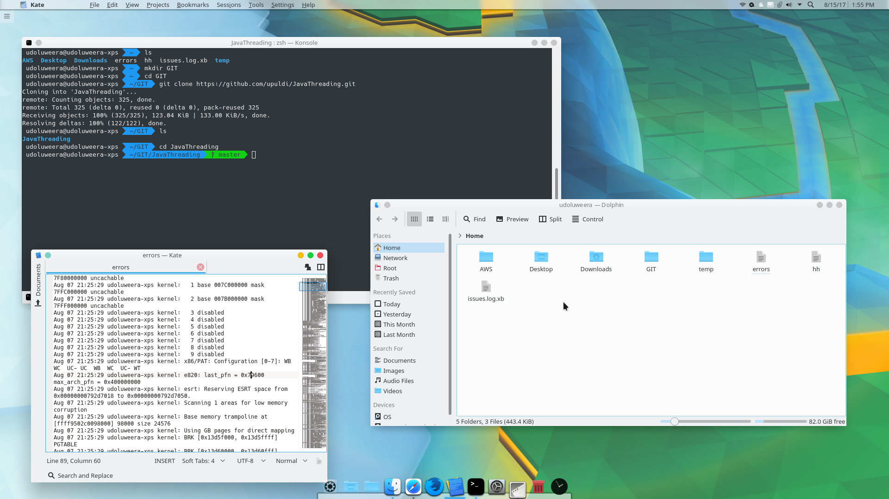
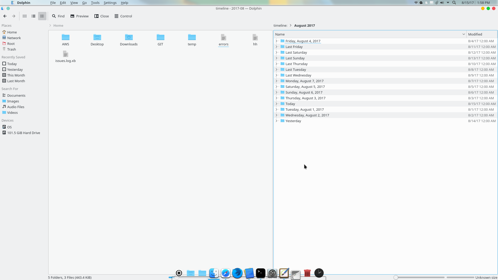
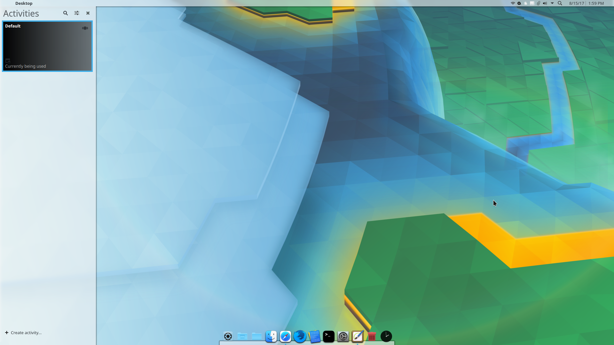
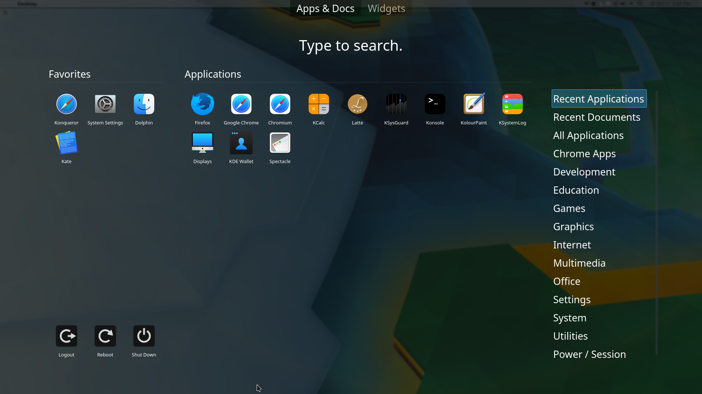
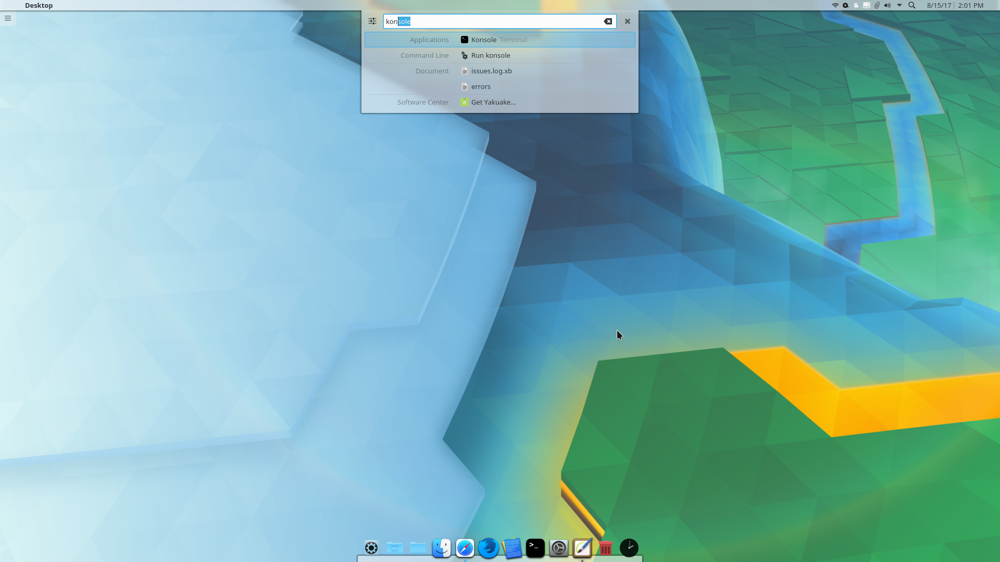
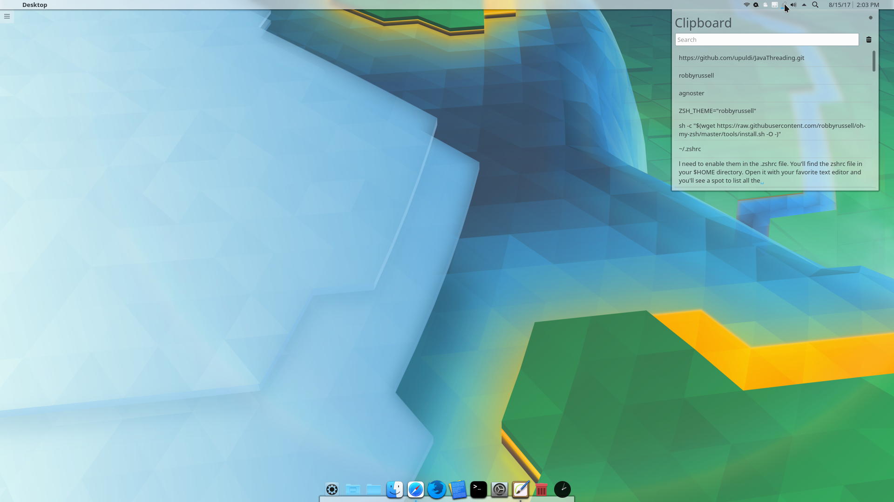
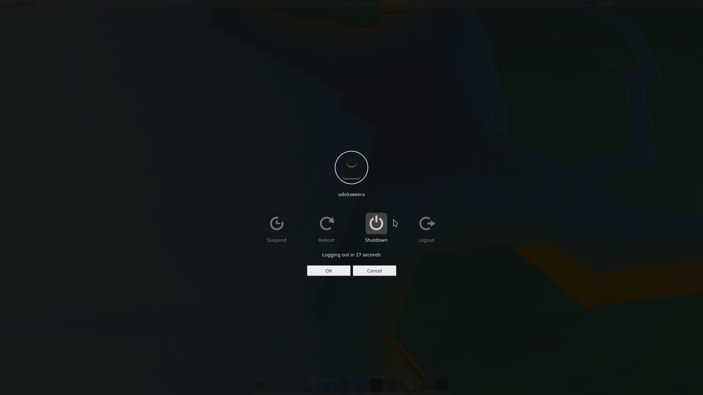

## Arch Linux Customizations

1.Copy the openbox folder into your .config directory.
2.Place the AppConfig folder in your home directory.
3.Move the Commands folder to your home directory and rename it to .Commands.
4. Add the Scripts folder to your home directory.

These changes will set up a pre-configured menu and environment for your Openbox setup.

The .Commands folder contains useful bash command snippets, so you don’t need to memorize them. To view any command, simply run:
```
bash
Copy
Edit
cat ~/.Commands/SomeCommandFile
```
The Scripts folder includes a collection of helpful scripts for everyday tasks.

ENJOY.

---

## 📸 Preview - KDE Plasma MacOS look and feel.







